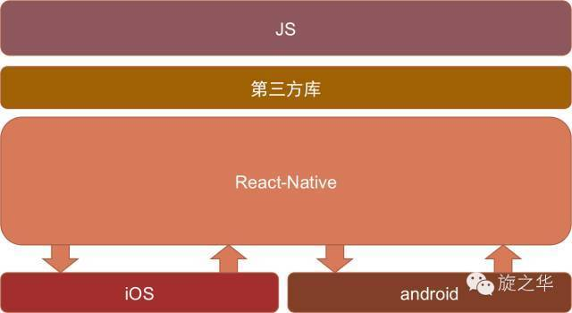
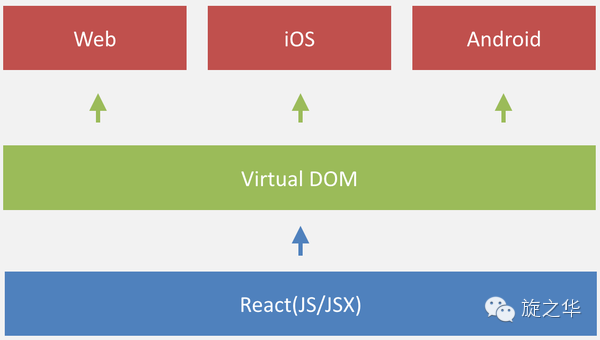

 Facebook于2015年9月15日发布**React Native**，发展成长至今，它成为原生手机端App必不可少的开发模式之一。目前比较成熟的跨平台方案:
```
1）React Native,  Vue+Weex
2）AppCan
3）Flutter
```
React Native已经完成了对多端的支持，实现了真正意义上的面向配置开发: 开发人员可以只使用JavaScript也能编写原生移动，结合React语法构建组件，实现：**Android, iOS 两端代码的复用**，并发布上线。



 React Native产出的并不是“网页应用”， 或者说“HTML5应用”，又或者“混合应用”，而是一个真正的移动应用，从使用感受上和用Objective-C或Java编写的应用相比几乎是无法区分的。

#### 一、开发平台选择？
######1）MacOS系统（推荐）
- iOS和Android都全部支持！

######2）Windows系统和Linux系统
- 目前只支持Android

####二、选择React Native的优势？
######1）跨平台开发

运用React Native，我们可以使用同一份业务逻辑核心代码来创建原生应用运行在Android端和iOS端；

######2）追求极致的用户体验：热更新和热部署  

######3）learn once，write everywhere（最具魅力）
 React Native不强求一份原生代码支持多个平台，所以不是“Write once, run anywhere”（Java），而是“Learn once, write anywhere”。



####三、React Native开发注意事项
 React Native所需要的技术栈比较多，需要良好的JavaScript功底，最好还需要懂一些iOS和Android原生开发，才能很好驾驭中大型移动端跨平台项目。初学者使用RN开发项目，建议选择：
- 功能适中，交互一般，不需要特别多的系统原生支持
- 对于部分复杂的应用，可以考虑原生+React Native混合开发