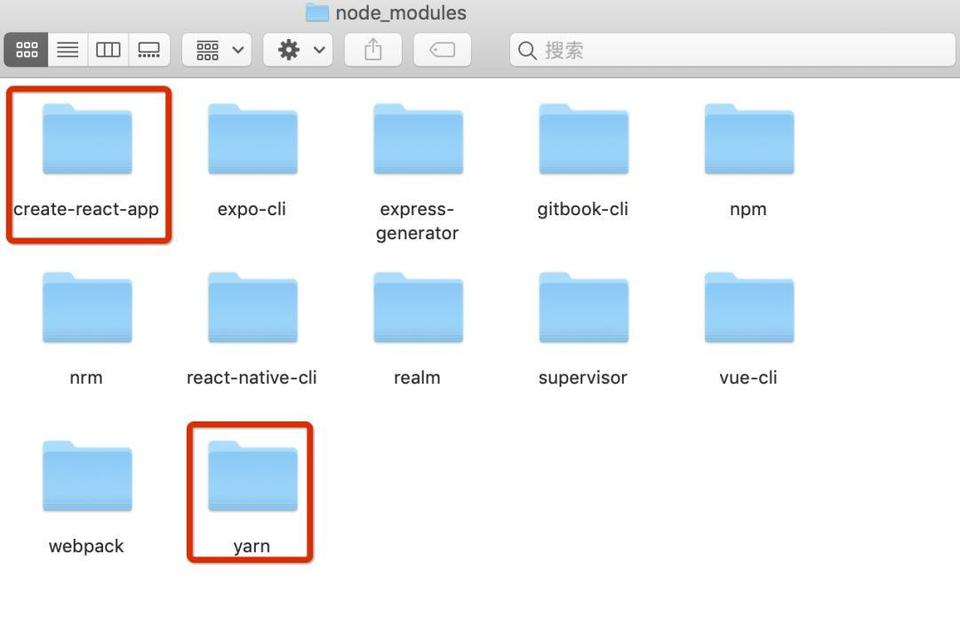

**-------------如果你使用的是Mac OS系统，请参照以下步骤-----------**

###### 安装前注意：

- 在Max OS X 系统中，homebrew在安装软件时可能会碰到/usr/local目录不可写的权限问题。可以使用下面的命令修复：
```
sudo chown -R `whoami` /usr/local
```
- 如果命令行提示command not found，请加上sudo获得最高权限 

####一、环境需求
######1） 安装Homebrew
Homebrew是OS X的套件(包)管理器，用于安装Node.js和一些其他必须的工具软件。

- 安装方式:
```
/usr/bin/ruby -e "$(curl -fsSL https://raw.githubusercontent.com/Homebrew/install/master/install)"
```

######2）  安装npm 和 Node.js
Node.js最好安装最新版本，node安装成功后npm自动也就有了，直接下载安装Node.js，网址：https://nodejs.org/en/download/ ，可以以软件形式安装，或者命令行形式安装：
```
brew install node
```

######3） 安装WatchMan
WatchMan是由Facebook提供的监视文件系统变更的工具。安装此工具可以提高开发时的性能（packager可以快速捕捉文件的变化从而实现实时刷新）。
```
brew install watchman
```
- 验证是否安装成功


####二、React Native安装

######1）Yarn、React Native的命令行工具（react-native-cli）

Yarn是Facebook提供的替代npm的工具，可以加速node模块的下载。React Native的命令行工具用于执行创建、初始化、更新项目、运行打包服务（packager）等任务。

######2）查看是否安装成功



####三、Xcode安装

React Native 目前需要Xcode 10 或更高版本。我们可以通过 App Store 或是到Apple 开发者官网上下载。安装完Xcode会同时安装 Xcode IDE、Xcode 的命令行工具和 iOS 模拟器。

####四、JDK 和 Android Studio

######1） 安装最新版的JDK

在命令行中输入``` javac -version```来查看你当前安装的JDK版本。下载安装地址：http://www.oracle.com/technetwork/java/javase/downloads/jdk8-downloads-2133151.html （资料中已经存放）

- 安装Android studio，在安装过程中请严格执行以下选项：

1、选择 Custom 选项


2、勾选`Performance`和`Android Virtual Device`


3、安装完成后，在Android Studio的启动欢迎界面中选择Configure | SDK Manager


4、在`SDK Platforms`窗口中，选择`Show Package Details`，然后在`Android 9.0 (Pie)`中勾选下图所示并安装。


5、在`SDK Tools`窗口中，选择`Show Package Details`，然后在`Android SDK Build Tools`中勾选`Android SDK Build-Tools 28.0.3`（必须有这个版本）。


6、ANDROID_HOME环境变量

React Native 需要通过环境变量来了解你系统中的 Android SDK 装在什么路径，从而正常进行编译。具体的做法是把下面的命令加入到~/.bash_profile文件中，使用  vi ~/.bash_profile。

```
# 如果你不是通过Android Studio安装的sdk，则其路径可能不同，请自行确定清楚。
export ANDROID_HOME=$HOME/Library/Android/sdk
export PATH=$PATH:$ANDROID_HOME/tools
export PATH=$PATH:$ANDROID_HOME/tools/bin
export PATH=$PATH:$ANDROID_HOME/platform-tools
export PATH=$PATH:$ANDROID_HOME/emulator
```

######2） 安装Genymotion

Genymotion是一个第三方模拟器，它比Google官方的模拟器更易设置且性能更好。但是，它只针对个人用户免费(可能需要VPN)。

- 下载并安装Genymotion(https://www.genymotion.com/)
- 打开Genymotion,如果你尚未安装VirtualBox,它有可能会提示你安装
- 创建一个模拟器并启动
- 按下⌘+M可以打开开发者菜单(在安装并启动了React Native应用之后)

###### 3）Gradle Daemon
开启Gradle Daemon可以极大地提升java代码的增量编译速度。

**-------------如果你使用的是Windows系统,请参照以下步骤-----------**

####一、确保所有的命令行操作都在管理员权限下操作

####二、需要安装的插件

###### 1） Chocolatey

Chocolatey是一个Windows上的包管理器，类似于Mac上的watchMan。一般的安装步骤应该是下面这样, 如果国内访问失败, 请使用翻墙工具:

###### 2） Python 2

```
choco install python2
```

###### 3）Node
```
choco install nodejs.install
```
打开命令提示符窗口，使用Chocolatey来安装NodeJS，或者通过软件安装。安装完node后建议设置npm镜像以加速后面的过程（或使用科学上网工具）。

```
 npm config set registry https://registry.npm.taobao.org --globalnpm
 npm config set disturl https://npm.taobao.org/dist --global
```

****-------------创建并运行React Native项目-----------****

#### 一、 React Native的第一个应用

###### 1）执行命令,生成一个工程
```
react-native init 项目名称
```
注意:由于众所周知的网络原因，需要等待一段时间（具体视网络情况而定）。react-native命令行从npm官方源拖代码时会遇上麻烦，可以将npm仓库源替换为国内镜像：
```
npm config set registry https://registry.npm.taobao.org
npm config set disturl https://npm.taobao.org/dist
```
###### 2）运行截图


###### 3）运行工程文件

不管是 iOS 还是 Android，在开发调试阶段，都需要在 Mac 上启动一个 HTTP 服务，称为`Debug Server`，默认运行在`8081`端口，APP 通 `Debug Server `加载 js。


        


###### 4） 把React Native创建的应用跑在Android上

- 命令行执行cd MyRNDemo,路径切换到项目主目录
- 命令行执行react-native run-android进行加载运行android 应用。
- 使用编辑器进行打开和修改index.android.js文件，接着通过菜单按钮选择Reload JS来进行刷新修改


####二、管理React Native库的版本

在开发中，会经常的去控制React Native的版本库，得以适配各种条件下的开发，那该如何查看、控制ReactNative的版本呢？

###### 1）查看本地的React Native的版本
- 命令行输入:
```
react-native --version
```
- 命令行效果:


######2） 更新本地的React Native的版本

- 命令行输入:
```
npm update -g react-native-cli
```

###### 3）查询react-native的npm包最新版本

NPM的全称是Node Package Manager ，是一个NodeJS包管理和分发工具，已经成为了非官方的发布Node模块（包）的标准。

- npm包地址 ：
```
 https://www.npmjs.com/package/react-native
```
- 命令行查询： 
```
npm info react-native
```
- 查询效果：
