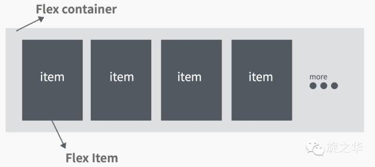
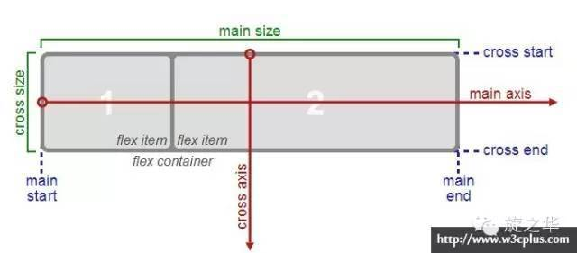
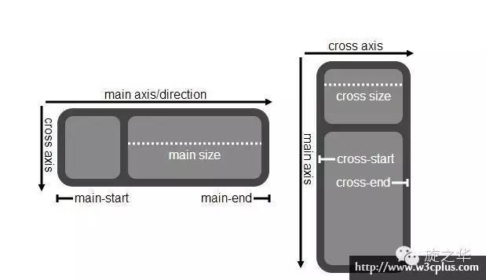
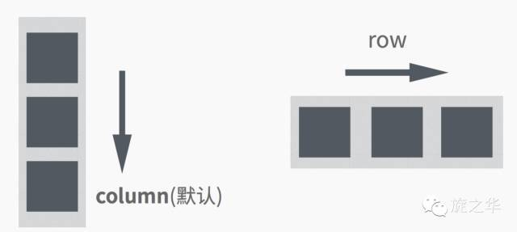
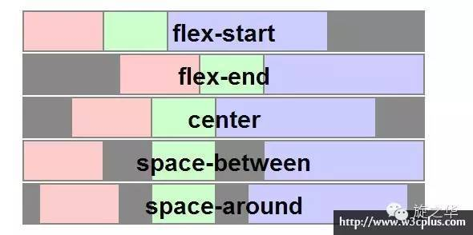
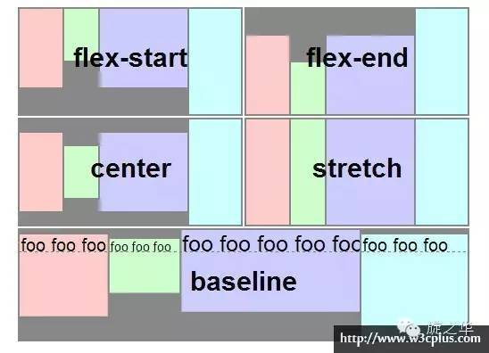
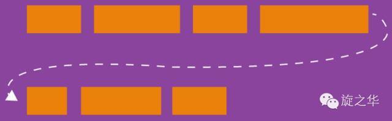
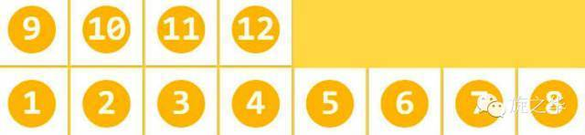
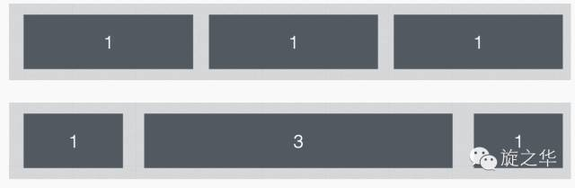
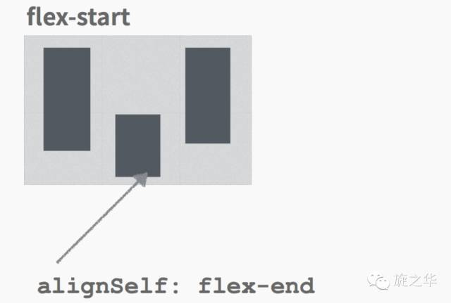

####  一、FlexBox布局

###### 1.1 FlexBox是什么意思呢？

- flexible（形容词）：能够伸缩或者很容易变化，以适应外界条件的变化
- box（名词）：通用的矩形容器


###### 1.2  什么是FlexBox布局?

弹性盒模型（The Flexible Box Module）,又叫Flexbox，意为“弹性布局”，旨在通过弹性的方式来对齐和分布容器中内容的空间，使其能适应不同屏幕，为盒装模型提供最大的灵活性。

Flex布局主要思想是：让容器有能力让其子项目能够改变其宽度、高度（甚至是顺序），以最佳方式填充可用空间；

React native中的FlexBox是这个规范的一个**子集**。


###### 1.3 大部分情况下是处理图中FlexItem在FlexContainer中的位置和尺寸关系




####  二、Flexbox在开发中的应用场景

###### 2.1 Flexbox在布局中能够解决什么问题
- 浮动布局
- 各种机型屏幕的适配
- 水平和垂直居中
- 自动分配宽度
-  ......


######  2.2 在CSS中，常规的布局是基于块和内联流方向，而Flex布局是基于flex-flow流,下图很好解释了Flex布局的思想：



容器默认存在两根轴：**水平的主轴（main axis）**和**垂直的交叉轴（cross axis）**。主轴的开始位置（与边框的交叉点）叫做main start，结束位置叫做main end；交叉轴的开始位置叫做cross start，结束位置叫做cross end。

项目默认沿主轴排列，单个项目占据的主轴空间叫做main size，占据的交叉轴空间叫做cross size。

###### 2.3 根据伸缩项目排列方式的不同，主轴和侧轴方向也有所变化：


#### 三、Flexbox的常用属性

######  3.1 容器属性

a)  flexDirection: `row | row-reverse | column | column-reverse`

- 该属性决定主轴的方向（即项目的排列方向）。
- row：主轴为水平方向，起点在左端。
- row-reverse：主轴为水平方向，起点在右端。
- column(默认值)：主轴为垂直方向，起点在上沿。
- column-reverse：主轴为垂直方向，起点在下沿。




b）justifyContent:`flex-start | flex-end | center | space-between | space-around`

- 定义了伸缩项目在主轴线的对齐方式
- flex-start(默认值)：伸缩项目向一行的起始位置靠齐。
- flex-end：伸缩项目向一行的结束位置靠齐。
- center：伸缩项目向一行的中间位置靠齐。
- space-between：两端对齐，项目之间的间隔都相等。
- space-around：伸缩项目会平均地分布在行里，两端保留一半的空间。




c） alignItems:  `flex-start | flex-end | center | baseline | stretch`

定义项目在交叉轴上如何对齐，可以把其想像成侧轴（垂直于主轴）的“对齐方式”。
- flex-start：交叉轴的起点对齐。
- flex-end：交叉轴的终点对齐 。
- center：交叉轴的中点对齐。
- baseline：项目的第一行文字的基线对齐。
- stretch（默认值）：如果项目未设置高度或设为auto，将占满整个容器的高度。
  




d)  flexWrap: `nowrap | wrap | wrap-reverse`

默认情况下，项目都排在一条线（又称"轴线"）上。flex-wrap属性定义，如果一条轴线排不下，如何换行。



- nowrap(默认值)：不换行。


- wrap：换行，第一行在上方。


- wrap-reverse：换行，第一行在下方。（和wrap相反）




###### 3.2 元素属性

 a）flex

“flex-grow”、“flex-shrink”和“flex-basis”三个属性的缩写， 其中第二个和第三个参数（flex-shrink、flex-basis）是可选参数。

   默认值为“0 1 auto”。

   宽度 ＝ 弹性宽度 * ( flexGrow / sum( flexGorw ) )

 


b）alignSelf:  “auto | flex-start | flex-end | center | baseline | stretch”

align-self属性允许单个项目有与其他项目不一样的对齐方式，可覆盖align-items属性。默认值为auto，表示继承父元素的align-items属性，如果没有父元素，则等同于stretch。




#### 四、在React Native中使用Flexbox

###### 4.1  获取当前屏幕的宽度、高度、分辨率

```
const App: () => React$Node = () => {
    return (
        <>
            <StatusBar barStyle="dark-content"/>
            <SafeAreaView style={{flex: 1}}>
                <View style={{flex: 1, backgroundColor: 'red'}}>
                   <Text>
                     当前屏幕的宽度：{Dimensions.get('window').width + '\n'}
                     当前屏幕的高度：{Dimensions.get('window').height + '\n'}
                     当前屏幕的分辨率：{Dimensions.get('window').scale + '\n'}
                   </Text>
                </View>
            </SafeAreaView>
        </>
    );
};
```