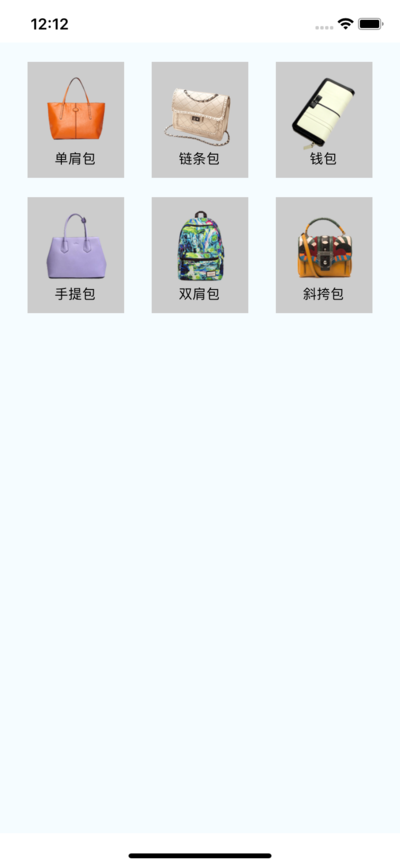

#### 一、 View组件

React Native组件View，其作用等同于iOS中的UIView, Android中的android.view，或是网页中的<div>标签，它是所有页面组件的父组件。使用方式无差异化，基本用于容器使用。

```
const App: () => React$Node = () => {
    return (
        <SafeAreaView style={{flex: 1}}>
          <View style={{flex: 1, backgroundColor: 'cyan'}}>
            <View style={styles.view1}>
              <Text style={{color: '#fff', fontSize: 18}}>内容区域</Text>
            </View>
          </View>
        </SafeAreaView>
    );
};

const styles = StyleSheet.create({
  view1: {
    width: 150,
    height: 200,
    backgroundColor:'purple',
    marginLeft: 100,
    marginTop: 100,
    padding: 30
  }
});
```


#### 二、Text组件

一个用于显示文本的ReactNative组件，和Android中的TextView组件或者OC中的UILabel组件相类似，专门用来显示基本的文本信息；除了基本的显示布局之外，可以进行嵌套显示，设置样式，以及可以做事件(例如:点击)处理。

- 常用属性
```
`color` 字体颜色
 `numberOfLines` (number) 进行设置Text显示文本的行数，如果显示的内容超过了行数，默认其他多余的信息就不会显示了
`ellipsizeMode` 这个属性通常和下面的 numberOfLines 属性配合使用，表示当 Text 组件无法全部显示需要显示的字符串时如何用省略号进行修饰。取值：enum('head', 'middle', 'tail', 'clip')
`onPress` (fcuntion)  该方法当文本发生点击的时候调用该方法

 `color`  字体颜色
`fontFamily`  字体名称
`fontSize`  字体大小
`fontStyle`   字体风格(normal,italic)
`fontWeight ` 字体粗细权重("normal", 'bold', '100', '200', '300', '400', '500', '600', '700', '800', '900')
`textShadowOffset`  设置阴影效果{width: number, height: number}
`textShadowRadius`  阴影效果圆角
`textShadowColor`  阴影效果的颜色
`letterSpacing`  字符间距
`lineHeight`  行高
`textAlign`   文本对其方式("auto", 'left', 'right', 'center', 'justify')
`textDecorationLine`  横线位置 ("none", 'underline', 'line-through', 'underline line-through')
`textDecorationStyle` 线的风格("solid", 'double', 'dotted', 'dashed')
 `textDecorationColor` 线的颜色
`writingDirection` 文本方向("auto", 'ltr', 'rtl')
```

- 课程代码
```
import React, { Component } from 'react';
import { Text, StyleSheet, View } from 'react-native';

export default class LKText extends Component {
    constructor(props) {
        super(props);
        this.state = {
            titleText: 'demo学院',
            subText: '喜欢IT,就上demo！',
            bodyText: '对酒当歌，人生几何！对酒当歌，人生几何！对酒当歌，人生几何！'
        };
    }

    render() {
        return (
            <>
                <Text style={styles.baseText}>
                    <Text style={styles.titleText}>
                        {this.state.titleText}{'\n'}
                    </Text>
                    <Text>
                        {this.state.subText}
                    </Text>
                </Text>
                <View style={{backgroundColor:'red', width: 300, height: 200}}>
                    <Text
                        style={{fontSize: 20, lineHeight: 40}}
                        numberOfLines={4}
                        ellipsizeMode='middle'
                    >
                        {this.state.bodyText}
                    </Text>
                </View>
            </>
        );
    }
}

const styles = StyleSheet.create({
    baseText: {
        fontFamily: 'Cochin',
        fontSize: 30
    },
    titleText: {
        fontSize: 40,
        fontWeight: 'bold',
    },
});
```


#### 三、Image组件

在开发中还有一个非常重要的组件Image，通过这个组件可以展示各种各样的图片，而且在React Native中该组件可以通过多种方式加载图片资源。包括网络图片、静态资源、临时的本地图片、以及本地磁盘上的图片（如相册）等。

- 常用使用，三种加载方式
```
 render() {
        return (
            <View>
                {/*本地加载*/}
                <Image
                    source={require('./images/images/bit.jpeg')}
                    style={{width: 200, height: 200}}
                />
                {/*网络加载*/}
                <Image
                    style={{width: 168, height: 168}}
                    source={{uri: 'http://www.itlike.com/template/simple/res/404/img/xiaoliao.png'}}
                />
                {/*base64加载*/}
                <Image
                    style={{width: 66, height: 58}}
                    source={{uri: 'data:image/png;base64,iVBORw0KGgoAAAANSUhEUgAAADMAAAAzCAYAAAA6oTAqAAAAEXRFWHRTb2Z0d2FyZQBwbmdjcnVzaEB1SfMAAABQSURBVGje7dSxCQBACARB+2/ab8BEeQNhFi6WSYzYLYudDQYGBgYGBgYGBgYGBgYGBgZmcvDqYGBgmhivGQYGBgYGBgYGBgYGBgYGBgbmQw+P/eMrC5UTVAAAAABJRU5ErkJggg=='}}
                />
            </View>
        );
    }
```
- 设置图片的显示模式，resizeMode，常用取值有：`center、repeat、contain、cover、stretch`。

```
render() {
        return (
            <View>
                <Image
                    style={{width: 400, height: 300, resizeMode: 'stretch', backgroundColor:'red'}}
                    source={{uri: 'http://www.itlike.com/template/simple/res/404/img/xiaoliao.png'}}
                />
            </View>
        );
    }
```
- 设置背景图片-ImageBackground组件
```
 render() {
        return (
            <View>
                <ImageBackground
                    source={require('./images/images/lk.jpg')}
                    style={{width: 400, height: 200}}
                >
                    <Image
                        style={{width: 168, height: 168}}
                        source={{uri: 'http://www.itlike.com/template/simple/res/404/img/xiaoliao.png'}}
                    />
                    <Text style={{color:'#fff'}}>我是小撩同学！</Text>
                </ImageBackground>
            </View>
        );
    }
```

-  Image组件的小练习

通过一款包包的展示，总结前面所学的View，Text和今天的Image组件，具体效果如下:



核心代码：
```
_renderItem() {
        // 1. 组件数组
        let itemArr = [];
        // 2. 遍历数据数组
        for (let i = 0; i < dataArr.length; i++) {
            // 2.1 取出单个数据
            let data = dataArr[i];
            // 2.2 根据数据创建组件装入组件数组
            itemArr.push(
                <View key={i} style={styles.itemViewStyle}>
                    <Image source={{uri: data.icon}} style={{width:80, height:80}}/>
                    <Text>{data.name}</Text>
                </View>
            )
        }
        // 3. 返回数组
        return itemArr;

    }
```