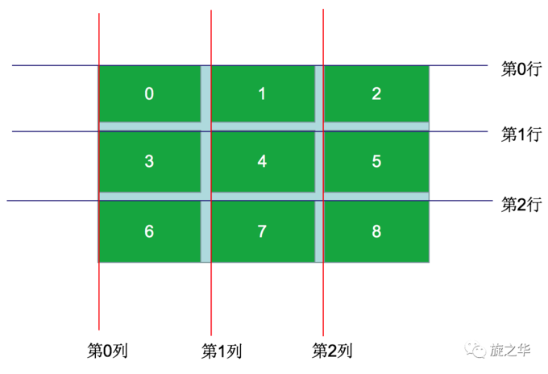
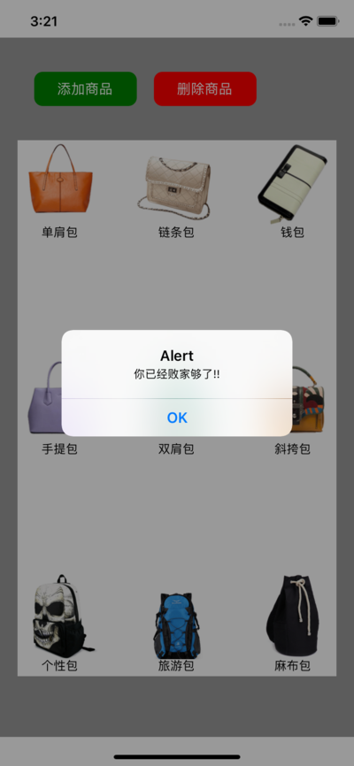

#### 一、TextInput
文本输入框，相当于OC中的UITextField，在用法和属性方面，两者都有很大的借鉴之处：通过键盘将文本输入到应用程序的一个基本的组件。

本组件的属性提供了多种特性的配置，譬如自动完成、自动大小写、占位文字，以及多种不同的键盘类型（如纯数字键盘）等等。

###### 常用属性

> value 字符串型

   文本输入的默认值

> onChangeText 函数   

 监听输入框中输入的值

> keyboardType  键盘类型

决定弹出何种软键盘类型，譬如numeric。

所有平台都可用：`default , number-pad，decimal-pad，numeric，email-address， phone-pad`；

仅iOS可用：`ascii-capable，numbers-and-punctuation，url，name-phone-pad，twitter，web-search`；

仅Android平台可用：`visible-password`

> multiline  布尔型

如果值为真，文本输入可以输入多行。默认值为假。

>  placeholder 字符串型

在文本输入之前字符串将被呈现出来，通常被称为占位文字

> placeholderTextColor  字符串型

占位符字符串的文本颜色

> autoCapitalize

控制TextInput是否要自动将特定字符切换为大写，取值：

- characters：所有字符，
- words：每一个单词的首字母
- sentences：每个句子的首字母（默认情况下）
- none：不会自动使用任何东西

> clearButtonMode
> enum('never', 'while-editing', 'unless-editing', 'always')

清除按钮出现在文本视图右侧的时机，仅在单行模式下可用

> editable  布尔型

如果值为假，文本是不可编辑的。默认值为真。

> onBlur 函数

当文本框失去焦点的时候调用此回调函数

> onChangeText 函数

当文本输入的文本发生变化时，调用回调函数

> onFocus 函数

当输入的文本是聚焦状态时，调用回调函数

> returnKeyType
> enum('default', 'go', 'google', 'join', 'next', 'route', 'search', 'send', 'yahoo', 'done', 'emergency-call')

决定返回键的样式


#### 二、Touchable系列组件

###### 1）高亮触摸  TouchableHighlight

 当手指点击按下的时候，该视图的不透明度会进行降低同时会看到相应的颜色，其实现原理则是在底层新添加了一个View。此外，TouchableHighlight只能进行一层嵌套，不能多层嵌套。

- 常用属性：

>activeOpacity  number 
>设置组件在进行触摸的时候，显示的不透明度(取值在0-1之间)

> onHideUnderlay  function  方法
>  当底层被隐藏的时候调用

>onShowUnderlay  function 方法
> 当底层显示的时候调用

>style  
>可以设置控件的风格演示，该风格演示可以参考View组件的style

>underlayColor 
> 当触摸或者点击控件的时候显示出的颜色


###### 2）不透明触摸  TouchableOpacity

该组件封装了响应触摸事件；当点击按下的时候，该组件的透明度会降低。

- 常用属性：
> activeOpacity  number  
> 设置当用户触摸的时候，组件的透明度

- 代码实操
```
render() {
        return (
            <View>
                <TouchableOpacity
                    style={{width: 100, height: 60, backgroundColor:'red'}}
                    activeOpacity={0.5}
                    onPress={()=>this.activeEvent('点击')}
                    onPressIn={()=>this.activeEvent('按下')}
                    onPressOut={()=>this.activeEvent('抬起')}
                    onLongPress={()=>this.activeEvent('长按')}
                >
                    <Text>按下</Text>
                </TouchableOpacity>

                <Text>{this.state.eventTag}</Text>
            </View>
        );
    }

    activeEvent(tag){
        this.setState({
            eventTag: tag
        })
    }
```


#### 三、按钮

一个简单的跨平台的按钮组件。可以进行一些简单的定制。
```
<Button
  onPress={()=>this.onBtnClick()}
  title="我是一个按钮"
  color="#841584"
  />
```


#### 四、案例实操

###### 1）案例主要技术点：充分利用了RN生命周期的钩子函数，实现界面刷新。
- 利用控件的索引index计算出控件所在的行号和列号
- 利用列号计算控件的x值
- 利用行号计算控件的y值

###### 2）案例思路截图




###### 3）案例效果图




###### 4）案例核心代码

```
import React, {Component} from 'react';
import {
    StyleSheet,
    Text,
    View,
    TouchableOpacity,
    Image,
    Dimensions
} from 'react-native';

const {width, height} = Dimensions.get('window');

// 获取本地数据
const dataArr = require('./images/localData/packageData.json');

export default class LKFlexView extends Component {
    // 构造
    constructor(props) {
        super(props);
        // 初始状态
        this.state = {
            // 购物车数组
            shopArr: []
        };
    }

    render() {
        return (
            <View style={styles.container}>
                {/*上部分*/}
                <View style={styles.topViewStyle}>
                    <TouchableOpacity style={styles.clickBtnStyle} onPress={()=>this._addShop()}>
                        <Text style={styles.btnTextStyle}>添加商品</Text>
                    </TouchableOpacity>
                    <TouchableOpacity style={[styles.clickBtnStyle, {backgroundColor:'red'}]}  onPress={()=>this._removeShop()}>
                        <Text style={styles.btnTextStyle}>删除商品</Text>
                    </TouchableOpacity>
                </View>
                {/*下部分*/}
                <View style={styles.bottomViewStyle}>
                    {this.state.shopArr}
                </View>
            </View >
        );
    }

    /**
     * 添加商品
     */
    _addShop() {
        // 1. 定义相关的常量(总列数, 商品的宽度\高度)
        const cols = 3, shopW = 100, shopH = 120;

        // 2. 取出下标
        let index = this.state.shopArr.length;
        if(index >= 9){
            alert('你已经败家够了!!');
            return;
        }

        // 3. 求出当前盒子所在的行数和列数
        let row = parseInt(index / cols);
        let col = parseInt(index % cols);

        // 4. 求出当前盒子的left和top
        let xSpace = (0.9 * width - cols * shopW) / (cols - 1);
        let ySpace = (0.7 * height - 3 * shopH) / 2;

        let left = col * (shopW + xSpace);
        let top = row * (shopH + ySpace);

        // 5. 创建组件装入数组
        let shopView = (
            <View style={{
                    position:'absolute',
                    left: left,
                    top: top,
                    justifyContent:'center',
                    alignItems:'center'
                  }}
                  key={index}
            >
                <Image source={{uri: dataArr[index].icon}} style={{width:shopW, height:shopW}}/>
                <Text>{dataArr[index].name}</Text>
            </View>
        );

        // 6. 取出购物车数组
        let tempArr = this.state.shopArr;
        tempArr.push(shopView);

        this.setState({
            shopArr: tempArr
        })

    }

    /**
     * 移除商品
     */
    _removeShop() {
        let tempArr = this.state.shopArr;
        if(tempArr.length === 0){
            alert('购物车空空如也~');
            return;
        }

        tempArr.pop();
        this.setState({
            shopArr: tempArr
        })
    }
}

const styles = StyleSheet.create({
    container: {
        flex: 1,
        backgroundColor: '#999',
    },

    topViewStyle: {
        flexDirection: 'row',
        margin: 30
    },

    clickBtnStyle: {
        width: 120,
        height: 40,
        borderRadius: 10,
        backgroundColor: 'green',

        // 主轴和侧轴都居中
        justifyContent: 'center',
        alignItems: 'center',
        margin: 10
    },

    btnTextStyle: {
        backgroundColor: 'transparent',
        fontSize: 16,
        color: '#fff'
    },

    bottomViewStyle: {
        width: 0.9 * width,
        height: 0.7 * height,
        backgroundColor: '#fff',
        marginLeft: 0.05 * width
    }

});
```